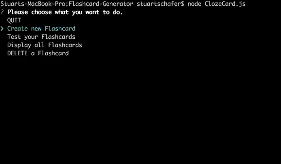

# Flashcard-Generator
A Nodejs app that allows users to enter flashcards and test out their flashcards.  Flashcards can also be deleted.

Users enter a sentence/phrase of their choosing, and are asked what words they wish to omit (so they can test themself on the flashcard).

All information is stored in a .json file so flashcards can be recalled after closing the app.

It is run by typing 'node ClozeCard.js' in terminal/bash.

Video demo:
https://drive.google.com/open?id=0B99Fu0owdBT7dVRGV2FCMFZPTzg
